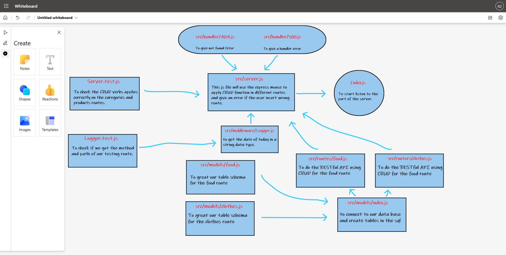

# basic-api-server

## Author: Rami Zregat

## Project: Express REST API

## Lab 3

**Description of today lab:**   
Today we will Perform CRUD Operations on a database

## Links to check:  

- Heroku application for main branch: https://ramizregat-basic-api-server.herokuapp.com/

- Github actions link: https://github.com/RamiZregat/basic-api-server/actions

- Github pull request link: https://github.com/RamiZregat/basic-api-server/pull/4

## Dependencies:
- dotenv
- express
- jest
- supertest
- pg
- sequelize
- sequelize-cli
- sqlite3

## How to start the server:  
- pgstart
- npm start

## What should I run on the terminal or postman?
- npm run test / on the terminal
- POST - http://localhost:3030/food
- GET - http://localhost:3030/food
- GET - http://localhost:3030/food/1
- PUT - http://localhost:3030/food/1
- DELETE - http://localhost:3030/food/1
- POST - http://localhost:3030/clothes
- GET - http://localhost:3030/clothes
- GET - http://localhost:3030/clothes/1
- PUT - http://localhost:3030/clothes/1
- DELETE - http://localhost:3030/clothes/1

## UML

